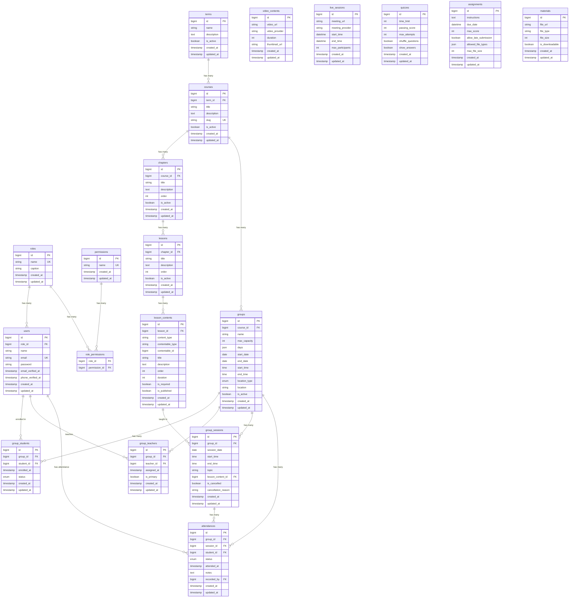

# Database ERD & System Flow

## 📊 Complete Database ERD (Mermaid Diagram)



---

## 🔄 System Flow Explanation (بالعربي)

### 1️⃣ هيكل الكورسات (Course Structure)

```
Term (الترم/الفصل الدراسي)
  └── Course (الكورس/المادة)
       └── Chapter (الفصل/الوحدة)
            └── Lesson (الدرس)
                 └── Lesson Content (محتوى الدرس)
                      ├── Video Content (فيديو مسجل)
                      ├── Live Session (بث مباشر - Template)
                      ├── Quiz (اختبار)
                      ├── Assignment (واجب)
                      └── Material (ملف/PDF)
```

### 2️⃣ هيكل المجموعات (Groups Structure)

```
Course (الكورس)
  └── Group (المجموعة)
       ├── Group Students (الطلاب المسجلين)
       ├── Group Teachers (المدرسين المعينين)
       └── Group Sessions (الحصص/السيشنز)
            └── Attendances (الحضور والغياب)
```

---

## 🎯 كيف يعمل النظام؟

### السيناريو الكامل:

#### 1. إنشاء الكورس والمحتوى
```
1. Admin ينشئ Term (مثلاً: "الترم الأول 2025")
2. Admin ينشئ Course تحت الـ Term (مثلاً: "رياضيات الصف الثالث")
3. Admin ينشئ Chapters (مثلاً: "الجبر", "الهندسة")
4. Admin ينشئ Lessons تحت كل Chapter
5. Admin يضيف Lesson Contents:
   - فيديوهات مسجلة (Video Content)
   - Live Sessions (قالب للبث المباشر)
   - Quizzes
   - Assignments
   - Materials (PDFs)
```

#### 2. إنشاء المجموعات
```
1. Admin ينشئ Group للكورس:
   - الاسم: "مجموعة أ - رياضيات"
   - الأيام: ["sunday", "tuesday", "thursday"]
   - الوقت: 09:00 - 11:00
   - النوع: online أو physical
   - السعة: 25 طالب

2. Admin يعين Teachers للمجموعة:
   - مدرس رئيسي (is_primary = true)
   - مدرسين مساعدين (is_primary = false)

3. Admin/Teacher يسجل Students في المجموعة
```

#### 3. إنشاء الحصص (Sessions)
```
Group Session = حصة فعلية في يوم معين

مثال:
- Group: "مجموعة أ - رياضيات"
- Session Date: 2025-01-05 (الأحد)
- Start Time: 09:00
- End Time: 11:00
- Topic: "مقدمة في الجبر"
- Lesson Content ID: 5 (يربط بـ Live Session content)
```

---

## 🔗 الربط بين Live Session و Group Session

### الفرق المهم:

| `live_sessions` (Content Type) | `group_sessions` (Actual Session) |
|-------------------------------|-----------------------------------|
| قالب/Template للبث المباشر | الحصة الفعلية |
| جزء من محتوى الدرس | مرتبط بمجموعة معينة |
| يحتوي على meeting_url, provider | يحتوي على التاريخ والوقت الفعلي |
| يُستخدم كمرجع | يُسجل فيه الحضور |

### كيف يدخل الطالب Live Session؟

```
1. الطالب مسجل في Group (group_students)
2. المجموعة لها Session اليوم (group_sessions)
3. الـ Session مرتبط بـ lesson_content_id
4. الـ lesson_content مرتبط بـ live_session (عبر contentable_type/id)
5. من الـ live_session نحصل على meeting_url

Flow:
Student → Group → Today's Session → Lesson Content → Live Session → Meeting URL
```

---

## 📱 API Flow للطالب

### 1. الحصول على الحصص القادمة
```
GET /api/groups/{groupId}/sessions?upcoming=true

Response:
{
  "sessions": [
    {
      "id": 1,
      "session_date": "2025-01-05",
      "start_time": "09:00",
      "end_time": "11:00",
      "topic": "مقدمة في الجبر",
      "lesson_content": {
        "id": 5,
        "title": "Live: مقدمة في الجبر",
        "content_type": "live_session",
        "live_session": {
          "meeting_url": "https://zoom.us/j/123456",
          "meeting_provider": "zoom"
        }
      }
    }
  ]
}
```

### 2. الدخول للحصة
```
GET /api/group-sessions/{sessionId}/join

Response:
{
  "meeting_url": "https://zoom.us/j/123456",
  "meeting_provider": "zoom",
  "can_join": true  // based on time and enrollment
}
```

---

## 🔐 Authorization Flow

```
1. Student requests to join session
2. System checks:
   ├── Is student enrolled in the group? (group_students)
   ├── Is the session for today/now? (group_sessions.session_date)
   ├── Is the session not cancelled? (is_cancelled = false)
   └── Is the group active? (groups.is_active = true)
3. If all checks pass → Return meeting URL
4. Record attendance (attendances)
```

---

## 📊 Visual Flow Diagram

```
┌─────────────────────────────────────────────────────────────────┐
│                         COURSE CONTENT                          │
│  ┌─────────┐   ┌─────────┐   ┌─────────┐   ┌───────────────┐   │
│  │  Term   │──▶│ Course  │──▶│ Chapter │──▶│    Lesson     │   │
│  └─────────┘   └─────────┘   └─────────┘   └───────┬───────┘   │
│                     │                              │            │
│                     │                              ▼            │
│                     │                     ┌───────────────┐     │
│                     │                     │Lesson Content │     │
│                     │                     │ (Polymorphic) │     │
│                     │                     └───────┬───────┘     │
│                     │                             │             │
│                     │         ┌───────────────────┼─────────┐   │
│                     │         ▼         ▼         ▼         ▼   │
│                     │    ┌───────┐ ┌───────┐ ┌───────┐ ┌─────┐ │
│                     │    │ Video │ │ Live  │ │ Quiz  │ │ ... │ │
│                     │    │Content│ │Session│ │       │ │     │ │
│                     │    └───────┘ └───┬───┘ └───────┘ └─────┘ │
└─────────────────────┼──────────────────┼────────────────────────┘
                      │                  │
                      ▼                  │ (meeting_url)
┌─────────────────────────────────────────────────────────────────┐
│                         GROUP SYSTEM                            │
│  ┌─────────┐                                                    │
│  │  Group  │◀─────────────────────────────────────────────┐     │
│  └────┬────┘                                              │     │
│       │                                                   │     │
│       ├──────────────┬──────────────┬─────────────────────┤     │
│       ▼              ▼              ▼                     │     │
│  ┌─────────┐   ┌──────────┐   ┌───────────┐              │     │
│  │ Group   │   │  Group   │   │   Group   │              │     │
│  │Students │   │ Teachers │   │  Sessions │──────────────┘     │
│  └────┬────┘   └────┬─────┘   └─────┬─────┘ (lesson_content_id)│
│       │             │               │                          │
│       │             │               ▼                          │
│       │             │        ┌─────────────┐                   │
│       └─────────────┴───────▶│ Attendances │                   │
│                              └─────────────┘                   │
└─────────────────────────────────────────────────────────────────┘
```

---

## 🎓 ملخص

1. **الكورس** يحتوي على المحتوى التعليمي (فيديوهات، كويزات، live sessions كقوالب)
2. **المجموعة** هي التنظيم الفعلي للطلاب والمدرسين
3. **Group Session** هي الحصة الفعلية في يوم معين
4. **الحضور**: يُسجل في جدول attendances لكل session

هذا التصميم يسمح بـ:
- نفس الكورس يكون له مجموعات متعددة
- كل مجموعة لها جدول مختلف
- كل مجموعة لها طلاب ومدرسين مختلفين
- تتبع الحضور لكل حصة

---

## 🔗 نظام روابط الاجتماعات (Meeting Links System)

### التصميم الجديد:

كل **Group Session** لها روابط خاصة بها:

```
group_sessions:
├── meeting_provider: "zoom" | "google_meet" | "teams" | "other"
├── meeting_id: "123456789"
├── meeting_password: "abc123"
├── moderator_link: "https://zoom.us/j/123?role=host"  ← للمدرس
└── attendee_link: "https://zoom.us/j/123?role=0"      ← للطلاب
```

### كيف يعمل؟

#### 1. الأدمن/المدرس ينشئ Session مع روابط الاجتماع:
```
POST /api/groups/{groupId}/sessions
{
  "session_date": "2025-01-05",
  "start_time": "09:00",
  "end_time": "11:00",
  "topic": "شرح الجبر",
  "meeting_provider": "zoom",
  "meeting_id": "123456789",
  "meeting_password": "abc123",
  "moderator_link": "https://zoom.us/j/123456789?role=1",
  "attendee_link": "https://zoom.us/j/123456789?role=0"
}
```

#### 2. الطالب/المدرس يطلب رابط الدخول:
```
GET /api/group-sessions/{sessionId}/join-link

Response للطالب:
{
  "role": "attendee",
  "join_url": "https://zoom.us/j/123456789?role=0",
  "meeting_id": "123456789",
  "meeting_password": "abc123",
  "meeting_provider": "zoom"
}

Response للمدرس:
{
  "role": "moderator",
  "join_url": "https://zoom.us/j/123456789?role=1",
  "meeting_id": "123456789",
  "meeting_password": "abc123",
  "meeting_provider": "zoom"
}
```

### Authorization Flow:

```
1. User requests join-link
2. System checks:
   ├── Is session cancelled? → Error
   ├── Has meeting links? → Error if not
   ├── Is user a teacher in this group? → Return moderator_link
   └── Is user a student in this group? → Return attendee_link
3. If not enrolled → 403 Forbidden
```

### الفرق عن التصميم القديم:

| القديم | الجديد |
|--------|--------|
| رابط واحد في `live_sessions` | رابطين في `group_sessions` |
| مشترك لكل المجموعات | خاص بكل حصة |
| لا يفرق بين مدرس وطالب | رابط مختلف لكل دور |

### مثال عملي:

```
Course: رياضيات الصف الثالث
├── Group A (مجموعة أ)
│   └── Session 1 (الأحد 09:00)
│       ├── moderator_link: zoom.us/j/111?host
│       └── attendee_link: zoom.us/j/111?join
│
└── Group B (مجموعة ب)
    └── Session 1 (الأحد 14:00)
        ├── moderator_link: zoom.us/j/222?host
        └── attendee_link: zoom.us/j/222?join

أحمد (طالب في Group A) → يحصل على zoom.us/j/111?join
محمد (مدرس في Group A) → يحصل على zoom.us/j/111?host
سارة (طالبة في Group B) → يحصل على zoom.us/j/222?join
```
